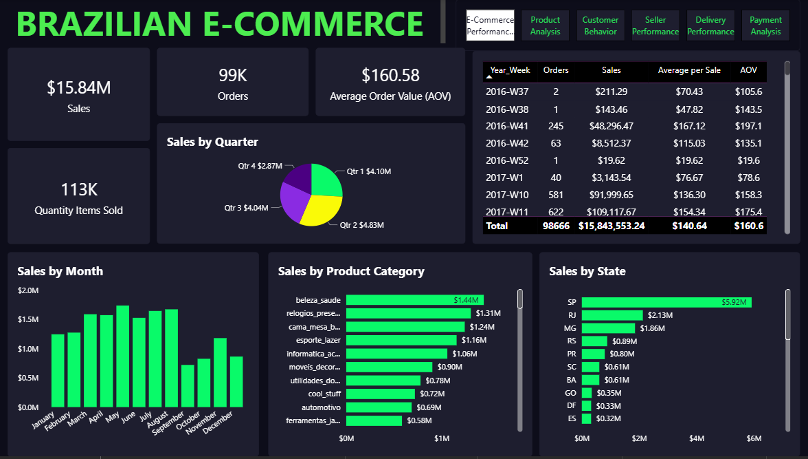
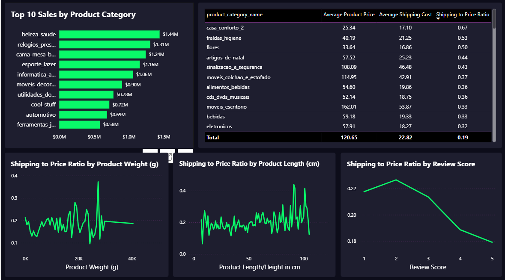
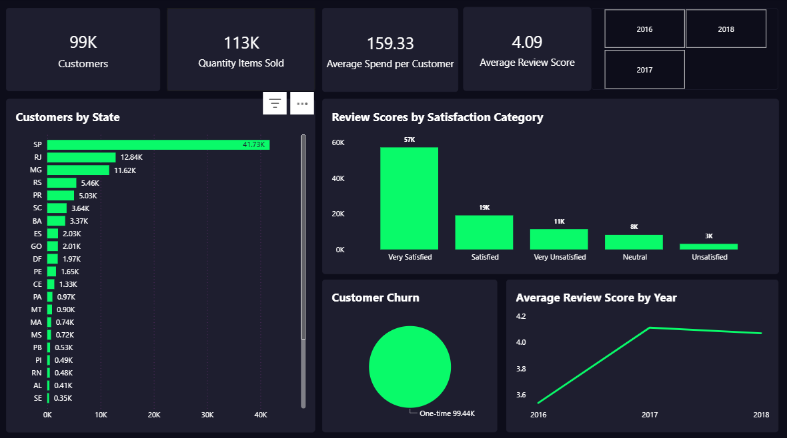
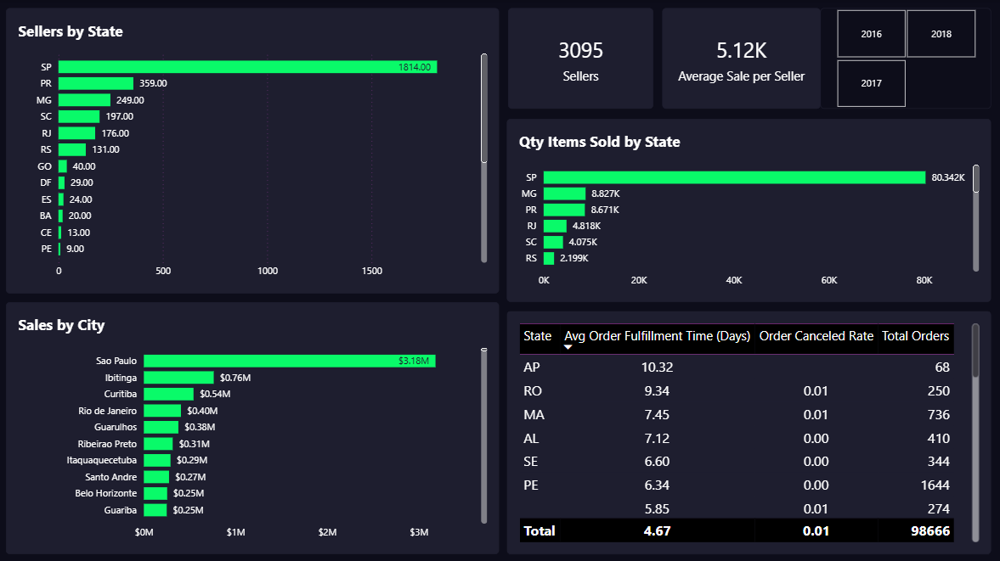
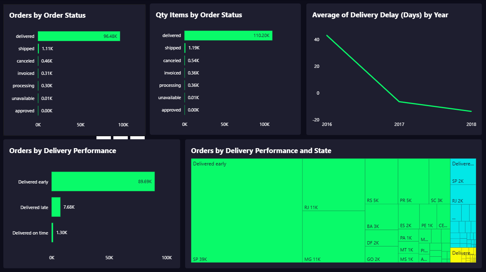
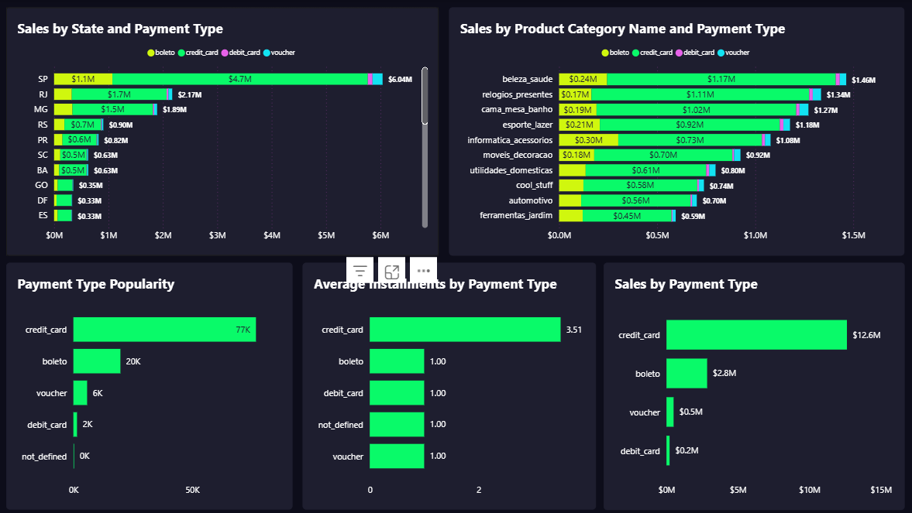

# Brazilian_Olist_E-Commerce
## This is the Study Case of the Brazilian E-Commerce Platform OLIST

Olist is a Brazilian tech & e-commerce company founded in 2015 in Curitiba, Paraná.
The dataset collected from Kaggle is full of missing values and mismatched data, a lot of typos. I tried to build a report based on the collected data. I cleaned up much of the data, corrected typos of a millions rows. When I started building the report i did not notice any issue until I want to build some KPIs, then I went back where I pulled the data and found a lot of comments stating how many things miss. Then I said to my self, what if the data were like that, what would it mean for a business. From there I tried to build as much as I can of some KPIs, and here is what I found:

### 1. Strong Revenue Performance with High-value Transactions

The business generated approximately $15.8M in sales across 99K orders for 3 years, resulting in a high Average Order Value of ~$160.
This indicates that Olist’s marketplace primarily attracts mid to high value consumer purchases, rather than low-cost impulse items.

### 2. Seasonal Sales Patterns Suggest Strategic Growth Opportunities

Sales consistently peak in Q2 and Q3, while Q4 underperforms, which is uncommon in retail.
This signals a potential opportunity to:
• Enhance holiday season campaigns
• Strengthen partnerships and promotional strategies during Q4.

### 3. Core Revenue Driven by Lifestyle and Home-Oriented Categories

Top-selling categories include:
• Beauty & Health
• Home & Decor (Bedding/Bath)
• Sports & Leisure
• Gifts & Watches

These categories reflect Olist’s strong alignment with everyday consumer lifestyle needs, which promotes recurring demand and brand familiarity.

### 4. Sales Concentrated in High-Purchasing Power Regions

The Southeast region (especially São Paulo and Rio de Janeiro) accounts for the majority of revenue.
This suggests:
• Effective penetration in Brazil’s economic hubs
• Opportunity to expand logistics and customer acquisition in growing markets such as the South and Northeast.

### 5. Metric Analysis/Implication

We have 113K total items sold slightly exceeds total customers, reinforcing the issue of churn (low repeat purchases).
We also have $159.33 average Spend per Customer. This figure is solid, suggesting that the average customer makes a substantial purchase when they do buy. The focus should be on getting them to make a second purchase. 
And finally, we have 4.09 of average Review Score which is a strong score, indicating a quality product/service experience, but this contradicts the churn rate and suggests the problem may lie in marketing/re-engagement rather than product quality.

We can now spot why so many churn of clients by analysing different metrics: the shipping cost. 

The extremely high churn rate (99.44K one-time customers) is most likely due to the following cycle: 

Initial Purchase: Customer buys a product ($159.33 average spend) and is Very Satisfied with the product quality (4.09 average score). 

Sticker Shock: The customer realizes the Shipping Cost is exorbitant relative to the product price (e.g., some products with over 50% of the cost). 

No Repeat Purchase: When considering a second purchase, the customer recalls the high shipping fee and decides the total cost is not worth it, leading to churn. 

The high average spend and high product satisfaction indicate a high-quality product that is being undermined by poorly priced logistics.

## 🛠️ Tools & Technologies
- **Power BI Desktop**
- **DAX (Data Analysis Expressions)**
- **Power Query**
- **Excel / CSV Data Source**
- **GitHub** for version control and project sharing

---

## 📁 Dataset
Dataset Information  
The dataset used in this project was obtained from [Kaggle](https://www.kaggle.com/datasets/olistbr/brazilian-ecommerce/data) originally published as part of Exploring the Brazilian Olist E-Commerce dataset. 
The dataset used contains information on: 
- Customer ID
- Seller ID
- Order ID
- Item ID
- State
- City
- Payment Type
- Review Score
- Delivery Time
- Product Category 

> *Note: The dataset is for educational purposes only.*

#### 📁 StudentPerformanceAnalysis/

├── README.md                                     – Summary overview  
├── Brazil_e_commerce_project                     – Power BI Report  
├── olist_customers_dataset                       – Customer Dataset  
├── olist_geolocation_summarized                  – Geolocation Dataset  
├── olist_order_items_dataset                     – Item Dataset  
├── olist_order_payment_dataset                   – Payment Dataset  
├── olist_order_reviews_dataset                   – Review Dataset  
├── olist_order_products_dataset                  – Product Dataset  
├── olist_orders_dataset                          – Order Dataset  
└── olist_sellers_dataset                         – Seller Dataset  
  

## 👤 Author
**Dieudonné Nahimana**  
🌐 [LinkedIn Profile](https://www.linkedin.com/in/nahimana-dieudonn%C3%A9-99b4a9200/)

## 📊 Dashboard Preview

#### 🎯 E-Commerce Performance Overview

#### Product Analysis

#### Customer Behavior Analysis

#### Seller Performance

#### Delivery Performance

#### Payment Type Analysis

